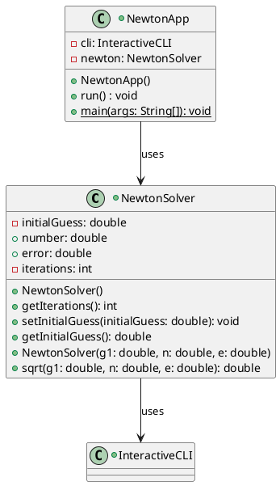
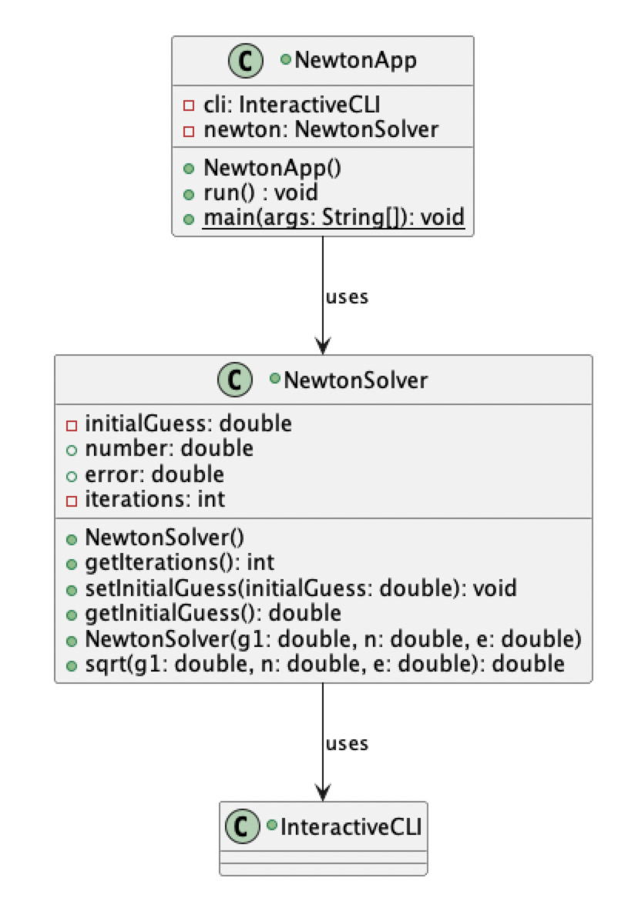
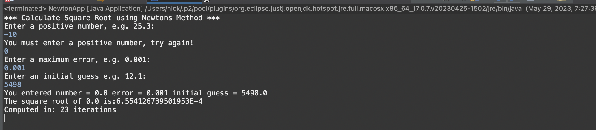
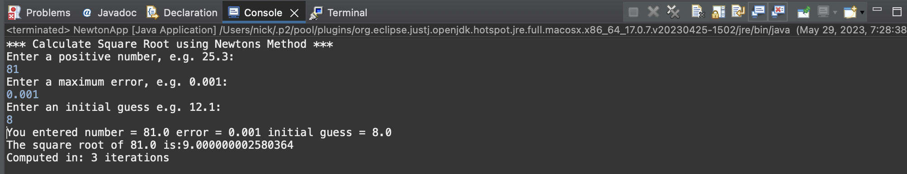

# Newton report
Author: Nick Nikolov

## UML class diagram

## Execution and Testing
Screenshot demonstrating successful execution and outputs for at least 3 numbers. 

This screenshot shows the UML diagram of the Newton square root application.

Shows output with input as -10 and with input as 0. shows re-prompt.

Shows output with input as 81

1. picked 81 as the number with 8 as an initial guess because it creates a negative error the first iteration.
Needed to correct this by taking the absolute value of the error and comparing to the maximum error. This is a common error for large inputs. 

2. picked -10 as the input to test if the program only allows positive inputs. shows that the program will reprompt for a negative input.

3. picked 0 as the input since zero has unique mathematical properties, I want to check if theres any bizarre functionality around zero. Definitely need to avoid division by zero. Also since the sqrt of zero is zero, it is easy to test if the error function is working correctly. 

