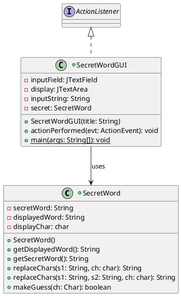
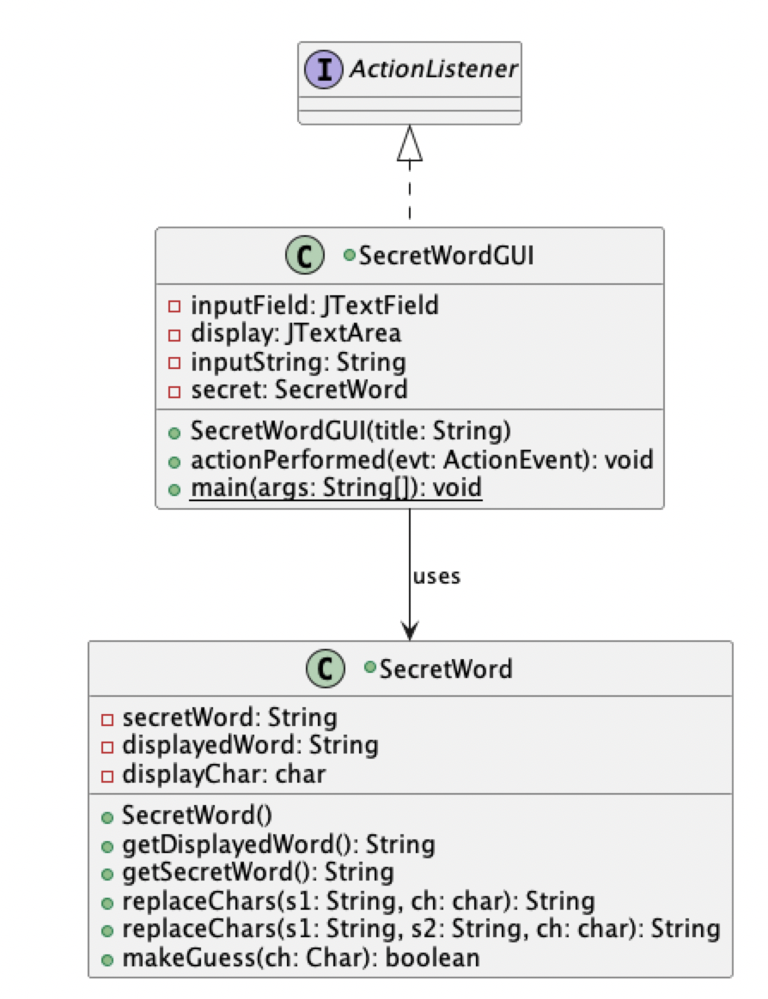
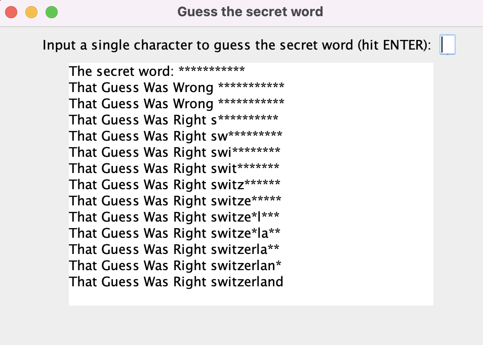

# SecretWord report
Author: Nick Nikolov

## UML class diagram

## Execution and Testing

This screenshot shows the UML diagram of the Secret Word game

This screenshot shows successful output of the secretWordGUI guessing game

# Reflection
I liked digging into the functionality of strings in the SecretWord program. 
They work much differently than in python, although there are some similarities. 
The hardest part was breaking down all the separate functionalities of the Secret Word program
The instructions of the assignment really helped guide me on which step to take on next. 

This was a fun project to show my family where they can play with a program I wrote myself.

Yves if you're reading this - If you can teach a few minutes on how to break down a difficult problem like this on our own it would be very helpful!
